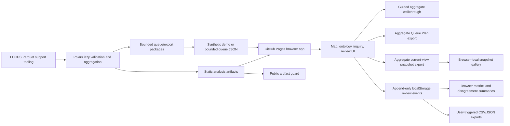

# EvoLOCUS Architecture

EvoLOCUS is now Pages-first for user interaction. GitHub Pages is the primary and only supported user-facing surface for this milestone.

Current evaluator architecture:

## Current Milestone

- GitHub Pages serves the workbench from `site/`.
- Browser JavaScript handles queue review, explorer filters, metrics, local persistence, and exports.
- Browser JavaScript handles the map, ontology, and static inquiry over `site/data/analysis/`.
- The Walkthrough tab orchestrates the public map, inquiry, ontology, queue planning, and snapshots into a guided real-aggregate demo flow without adding a separate data publication channel.
- Map selections can open aggregate-only selected-unit inquiry answers; the browser still reads only bounded static JSON artifacts.
- Inquiry prompt cards use current map filters and static artifacts to answer map, topic, function, audit, score, and selected-unit questions without live model calls.
- The manual analysis-refresh workflow can use `GROK_API_KEY` to refresh static inquiry briefings offline, then runs the public artifact guard before deploying Pages.
- Official geography can color counties and towns by neutral tier, dominant topic, dominant function, model-substantive share, audit attention, or law-count intensity; all are aggregate review aids.
- The Analysis Status tab reads `audit_status.json`, a full-row-count audit summary that excludes raw rows, ordinance text, sampled findings, and record locators.
- The map reads `unit_audit_quality.json`, a per-published-unit aggregate of OCR-risk and duplicate-text-hash review signals scoped to the public map layer.
- The Audit Lens tab renders `unit_audit_quality.json` as aggregate-only charts, state rows, OCR reason mix, and map drill-through links.
- The Score Lens tab renders released LOCUS model-score means from `map_layers.json` as neutral distributions, state matrices, and unit profiles.
- The Queue Plan tab combines current map filters, `map_layers.json`, and `unit_audit_quality.json` to rank aggregate county/town units for future local review packaging. Its export contains unit IDs, aggregate counts, review signals, and strategy metadata only.
- The map and inquiry tabs can export the current filtered view as aggregate JSON with filters, counts, selected-unit metadata, audit signals, and briefing provenance only.
- The Snapshots tab saves those aggregate current-view payloads in browser localStorage for comparison and reloads only filter state and selected aggregate unit IDs.
- Selected units render an ontology neighborhood from aggregate topic, function, tier, score, and geometry-match fields without publishing raw ordinance text.
- Selected units render peer comparisons against similar published aggregate units by shared topic, function, tier, kind, state, and law-count proximity; this is review context, not a legal ranking.
- Browser storage is local to the reviewer and is not a shared database.
- Demo mode is synthetic and conspicuously labeled.
- Real LOCUS aggregate artifacts are published through Pages after local safety checks.
- Real LOCUS rows and ordinance text are not published through Pages.
- Polars remains the support engine for local Parquet validation and queue preparation.

## Corpus Support Layer

`src/evolocus/locus_source.py` supports:

- `demo`: synthetic records, no network, safe default.
- `local`: one Parquet file or deterministic sorted glob of Parquet shards.
- `download`: blocked unless explicitly allowed by CLI code.

Raw LOCUS fields are preserved. Derived fields such as `record_id`, `source_locator`, normalized jurisdiction metadata, content lengths, content hash, and OCR-risk flags are added separately.

## Browser Evaluation Layer

`site/assets/app.js` owns the public workbench behavior:

- append-only review events in localStorage;
- blinded model output by default;
- explicit reveal logging;
- review save, save-next, skip, and flag actions;
- bounded queue import through the browser File API;
- content-free latest-review CSV export;
- review-event JSON export.

## Static Analysis Artifacts

`src/evolocus/analysis_publish.py` generates:

- `status.json`: analysis state, dataset revision, public-data flags, Grok policy.
- `map_layers.json`: state-clustered county/town-style units, neutral tier colors, law counts, model-score summaries.
- `unit_audit_quality.json`: per-unit OCR-risk, duplicate-text-hash, and audit-attention aggregates for the published map-unit scope.
- `ontology.json`: topics, functions, score dimensions, tiers, and jurisdiction-unit edges.
- `models.json`: imported LOCUS released model outputs and model-import policy.
- `chat_index.json`: deterministic inquiry entries for the browser chat panel.
- `inquiry_briefings.json`: progressive static answer briefings derived from aggregate artifacts.

Map tiers are review-priority bands over available model-score summaries and law counts. They are not rankings of legal burden, legality, freedom, or civic performance.

Audit attention is a review-priority signal from aggregate OCR-risk and duplicate-text-hash rates. It is not a legal ranking, proof of text defects, or a civic finding.

The Audit Lens uses the same progressive disclosure control as the map and status views: overview summarizes the aggregate scan, unit detail expands state and unit rows, and evidence trail exposes artifact scope and limitations.

The Score Lens uses the same filters and disclosure levels. It displays score values as neutral relative model outputs only; directional legal interpretations remain out of scope until authoritative model-card verification is added.

The Inquiry question matrix is a browser-side prompt surface over the same aggregate artifacts. It can fill and answer the inquiry form, but it does not call Grok or any browser-exposed LLM API.

The Queue Plan export is a planning artifact, not a real record-level LOCUS evaluation queue. It excludes ordinance text, headers, source locators, raw row data, SQLite state, and browser review events.

The current-view snapshot export is a shareable analysis artifact, not an evidence record. It excludes ordinance text, headers, raw row data, record locators, browser review events, local databases, and secrets.

The snapshot gallery is browser-local visual state. It compares saved aggregate views and exports gallery JSON with the same no-text/no-locator boundary.

The current public artifact set is a top-1,000 jurisdiction-unit aggregate layer generated from local LOCUS Parquet. It uses approximate state-clustered positions with state anchors until reviewed county/town geometry crosswalks are added.

## Grok Integration Boundary

The repository secret name is `GROK_API_KEY`. It may be used by offline GitHub Actions or local jobs to produce static aggregate-only inquiry briefings. It must not be exposed in Pages JavaScript because every browser-delivered asset is public.

The Actions refresh path uses the xAI Responses endpoint with model `grok-4.3` for offline enrichment when available. The generated artifact records whether Grok was used, and the Analysis Status tab surfaces that state.

## Optional Support Components

- SQLite: local support workflows and reproducible queue snapshots.
- DuckDB: optional ad hoc analytical SQL after evaluator MVP.
- LanceDB: optional semantic retrieval after human evaluation exists.
- Postgres: optional multi-user review store later.
- Census/FIPS/geospatial enrichment: deferred until reviewed crosswalks exist.

DuckDB is not required for the evaluator path and must not be used as a browser-side database.
