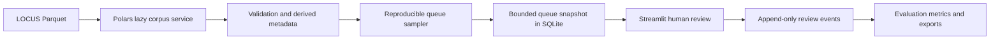

# EvoLOCUS Architecture

EvoLOCUS is a local-first evaluation and analytics platform for LOCUS-v1.

Current evaluator architecture:



## Current Milestone

- Polars is the primary corpus engine.
- Parquet is read lazily from demo or local modes.
- SQLite stores mutable evaluation state, not a copy of the full corpus.
- Streamlit runs the local human-evaluation workbench.
- GitHub Pages remains static documentation only.

## Corpus Layer

`src/evolocus/locus_source.py` supports:

- `demo`: synthetic records, no network, safe default.
- `local`: one Parquet file or deterministic sorted glob of Parquet shards.
- `download`: blocked unless explicitly allowed by CLI code.

Raw LOCUS fields are preserved. Derived fields such as `record_id`, `source_locator`, normalized jurisdiction metadata, content lengths, content hash, and OCR-risk flags are added separately.

## Evaluation Layer

`src/evolocus/evaluation_db.py` owns SQLite migrations and append-only review events. Queue items snapshot bounded selected text and model metadata so a queue is reproducible and resumable without copying the full 2.2M-row corpus into SQLite.

## UI Layer

Run locally:

```bash
EVOLOCUS_MODE=demo streamlit run dashboards/app.py
```

Pages:

- Review Queue
- Dataset Explorer
- Evaluation Results
- Protocol and Provenance

Every frontend surface includes research-only, OCR, model-label, current-law, and CC-BY-NC-4.0 notices.

## Optional Future Components

- DuckDB: optional ad hoc analytical SQL after evaluator MVP.
- LanceDB: optional semantic retrieval after human evaluation exists.
- Postgres: optional multi-user review store later.
- Census/FIPS/geospatial enrichment: deferred until reviewed crosswalks exist.

DuckDB is not required for the evaluator path and must not be used as a browser-side database.
