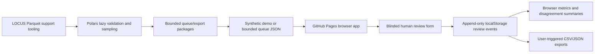

# EvoLOCUS Architecture

EvoLOCUS is now Pages-first for user interaction. GitHub Pages is the primary and only supported user-facing surface for this milestone.

Current evaluator architecture:

## Current Milestone

- GitHub Pages serves the workbench from `site/`.
- Browser JavaScript handles queue review, explorer filters, metrics, local persistence, and exports.
- Browser storage is local to the reviewer and is not a shared database.
- Demo mode is synthetic and conspicuously labeled.
- Real LOCUS rows are not published through Pages.
- Polars remains the support engine for local Parquet validation and queue preparation.

## Corpus Support Layer

`src/evolocus/locus_source.py` supports:

- `demo`: synthetic records, no network, safe default.
- `local`: one Parquet file or deterministic sorted glob of Parquet shards.
- `download`: blocked unless explicitly allowed by CLI code.

Raw LOCUS fields are preserved. Derived fields such as `record_id`, `source_locator`, normalized jurisdiction metadata, content lengths, content hash, and OCR-risk flags are added separately.

## Browser Evaluation Layer

`site/assets/app.js` owns the public workbench behavior:

- append-only review events in localStorage;
- blinded model output by default;
- explicit reveal logging;
- review save, save-next, skip, and flag actions;
- bounded queue import through the browser File API;
- content-free latest-review CSV export;
- review-event JSON export.

## Optional Support Components

- SQLite: local support workflows and reproducible queue snapshots.
- DuckDB: optional ad hoc analytical SQL after evaluator MVP.
- LanceDB: optional semantic retrieval after human evaluation exists.
- Postgres: optional multi-user review store later.
- Census/FIPS/geospatial enrichment: deferred until reviewed crosswalks exist.

DuckDB is not required for the evaluator path and must not be used as a browser-side database.
