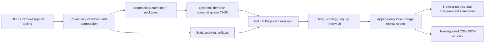

# EvoLOCUS Architecture

EvoLOCUS is now Pages-first for user interaction. GitHub Pages is the primary and only supported user-facing surface for this milestone.

Current evaluator architecture:

## Current Milestone

- GitHub Pages serves the workbench from `site/`.
- Browser JavaScript handles queue review, explorer filters, metrics, local persistence, and exports.
- Browser JavaScript handles the map, ontology, and static inquiry over `site/data/analysis/`.
- Map selections can open aggregate-only selected-unit inquiry answers; the browser still reads only bounded static JSON artifacts.
- Official geography can color counties and towns by neutral tier, dominant topic, dominant function, model-substantive share, or law-count intensity; all are aggregate review aids.
- The Analysis Status tab reads `audit_status.json`, a full-row-count audit summary that excludes raw rows, ordinance text, sampled findings, and record locators.
- Selected units render an ontology neighborhood from aggregate topic, function, tier, score, and geometry-match fields without publishing raw ordinance text.
- Selected units render peer comparisons against similar published aggregate units by shared topic, function, tier, kind, state, and law-count proximity; this is review context, not a legal ranking.
- Browser storage is local to the reviewer and is not a shared database.
- Demo mode is synthetic and conspicuously labeled.
- Real LOCUS aggregate artifacts are published through Pages after local safety checks.
- Real LOCUS rows and ordinance text are not published through Pages.
- Polars remains the support engine for local Parquet validation and queue preparation.

## Corpus Support Layer

`src/evolocus/locus_source.py` supports:

- `demo`: synthetic records, no network, safe default.
- `local`: one Parquet file or deterministic sorted glob of Parquet shards.
- `download`: blocked unless explicitly allowed by CLI code.

Raw LOCUS fields are preserved. Derived fields such as `record_id`, `source_locator`, normalized jurisdiction metadata, content lengths, content hash, and OCR-risk flags are added separately.

## Browser Evaluation Layer

`site/assets/app.js` owns the public workbench behavior:

- append-only review events in localStorage;
- blinded model output by default;
- explicit reveal logging;
- review save, save-next, skip, and flag actions;
- bounded queue import through the browser File API;
- content-free latest-review CSV export;
- review-event JSON export.

## Static Analysis Artifacts

`src/evolocus/analysis_publish.py` generates:

- `status.json`: analysis state, dataset revision, public-data flags, Grok policy.
- `map_layers.json`: state-clustered county/town-style units, neutral tier colors, law counts, model-score summaries.
- `ontology.json`: topics, functions, score dimensions, tiers, and jurisdiction-unit edges.
- `models.json`: imported LOCUS released model outputs and model-import policy.
- `chat_index.json`: deterministic inquiry entries for the browser chat panel.
- `inquiry_briefings.json`: progressive static answer briefings derived from aggregate artifacts.

Map tiers are review-priority bands over available model-score summaries and law counts. They are not rankings of legal burden, legality, freedom, or civic performance.

The current public artifact set is a top-1,000 jurisdiction-unit aggregate layer generated from local LOCUS Parquet. It uses approximate state-clustered positions with state anchors until reviewed county/town geometry crosswalks are added.

## Grok Integration Boundary

The repository secret name is `GROK_API_KEY`. It may be used by offline GitHub Actions or local jobs to produce static aggregate-only inquiry briefings. It must not be exposed in Pages JavaScript because every browser-delivered asset is public.

## Optional Support Components

- SQLite: local support workflows and reproducible queue snapshots.
- DuckDB: optional ad hoc analytical SQL after evaluator MVP.
- LanceDB: optional semantic retrieval after human evaluation exists.
- Postgres: optional multi-user review store later.
- Census/FIPS/geospatial enrichment: deferred until reviewed crosswalks exist.

DuckDB is not required for the evaluator path and must not be used as a browser-side database.
