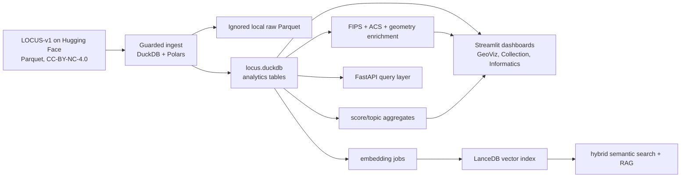

# Local Law Analytics Platform: Production Plan and Starter Code

This blueprint turns LOCUS-v1 into a laptop-friendly, reproducible analytics platform with guarded ingestion, geospatial enrichment, semantic search, RAG, and dashboards.

Canonical source:

- Dataset: https://huggingface.co/datasets/LocalLaws/LOCUS-v1
- Paper: Denis Peskoff, Joe Barrow, Christopher Vu, and Diag Davenport. "Freeing the Law with LOCUS: A Local Ordinance Corpus for the United States." arXiv:2606.19334, 2026.
- License: CC-BY-NC-4.0. Keep attribution and non-commercial use constraints visible in every public surface.

## 1. Executive Architecture Recommendation

Primary stack: local-first DuckDB + Parquet + Polars + LanceDB + Streamlit, with optional FastAPI and Postgres/pgvector migration later.

Why this stack:

- LOCUS-v1 is 2.211M rows and about 1.77 GB Parquet. DuckDB and Polars can scan and aggregate this scale efficiently on a laptop or small VM without running a database server.
- DuckDB gives durable SQL analytics, Parquet backups, and easy joins to Census/FIPS tables.
- Polars gives fast lazy validation and feature engineering when Python dataframe ergonomics are better than SQL.
- LanceDB stores local embeddings and metadata for semantic search without standing up pgvector on day one.
- Streamlit is fastest for the three required dashboards. FastAPI can expose stable query/search endpoints after schemas settle.
- Postgres + pgvector remains the scale-out path once multi-user writes, authorization, or hosted APIs matter.



Recommended repo layout additions:

```text
data/
  raw/                 # ignored: HF parquet snapshots
  processed/           # ignored: DuckDB, enriched parquet, LanceDB
  reference/           # reviewed small lookup tables only
src/evolocus/
  ingest_locus_full.py
  quality.py
  geo_enrich.py
  embeddings.py
  search.py
  api.py
dashboards/
  1_Collection.py
  2_Informatics.py
  3_GeoViz.py
```

## 2. Phase 1: Ingestion and Validation

### Environment

```bash
python3.11 -m venv .venv
source .venv/bin/activate
pip install duckdb polars pyarrow datasets huggingface_hub tqdm pandas
mkdir -p data/raw/locus_v1 data/processed data/reference
```

### Loading Strategy

Use one of three modes:

1. Fast full ingest: DuckDB scans local Parquet downloaded through Hugging Face Hub into ignored `data/raw/`.
2. Low-disk exploration: Hugging Face streaming with selected columns and filters.
3. Advanced direct scan: DuckDB `hf://` path when supported by the installed DuckDB/httpfs build; otherwise fall back to the local snapshot path.

Hugging Face streaming is documented as loading rows without downloading the full dataset, and Parquet streaming can select columns and filters.

### Copy-Paste Starter: Load LOCUS and Create First DuckDB Tables

Save as `src/evolocus/ingest_locus_full.py`.

```python
from __future__ import annotations

from dataclasses import dataclass
from pathlib import Path
import json

import duckdb
from huggingface_hub import snapshot_download


DATASET_ID = "LocalLaws/LOCUS-v1"
RAW_DIR = Path("data/raw/locus_v1")
DB_PATH = Path("data/processed/locus.duckdb")
BACKUP_DIR = Path("data/processed/parquet_backup")

EXPECTED_COLUMNS = {
    "header": "VARCHAR",
    "content": "VARCHAR",
    "is_substantive": "BOOLEAN",
    "function": "VARCHAR",
    "topic": "VARCHAR",
    "source_jurisdiction_type": "VARCHAR",
    "state": "VARCHAR",
    "city": "VARCHAR",
    "county": "VARCHAR",
    "enforcement_discretion": "DOUBLE",
    "opacity": "DOUBLE",
    "paternalism": "DOUBLE",
    "problem_salience": "DOUBLE",
}


@dataclass(frozen=True)
class IngestConfig:
    allow_download: bool = False
    use_hf_direct: bool = False
    row_limit: int | None = None


def parquet_source(config: IngestConfig) -> str:
    if config.use_hf_direct:
        # Works in DuckDB builds with Hugging Face hf:// support through httpfs.
        # If unsupported, use snapshot mode below.
        return "hf://datasets/LocalLaws/LOCUS-v1/**/*.parquet"

    if not allow_local_snapshot(config):
        raise SystemExit(
            "Refusing to download LOCUS-v1. Re-run with allow_download=True "
            "and keep outputs under ignored data/raw and data/processed."
        )

    RAW_DIR.mkdir(parents=True, exist_ok=True)
    snapshot_download(
        repo_id=DATASET_ID,
        repo_type="dataset",
        local_dir=str(RAW_DIR),
        allow_patterns=["*.parquet", "**/*.parquet"],
    )
    return str(RAW_DIR / "**" / "*.parquet")


def allow_local_snapshot(config: IngestConfig) -> bool:
    return config.allow_download or any(RAW_DIR.glob("**/*.parquet"))


def connect() -> duckdb.DuckDBPyConnection:
    DB_PATH.parent.mkdir(parents=True, exist_ok=True)
    con = duckdb.connect(str(DB_PATH))
    con.execute("INSTALL httpfs; LOAD httpfs;")
    con.execute("INSTALL spatial; LOAD spatial;")
    con.execute("PRAGMA threads=8;")
    con.execute("PRAGMA memory_limit='8GB';")
    return con


def validate_columns(con: duckdb.DuckDBPyConnection, source: str) -> None:
    cols = con.execute(f"DESCRIBE SELECT * FROM read_parquet('{source}') LIMIT 0").fetchall()
    actual = {name for name, *_ in cols}
    missing = set(EXPECTED_COLUMNS) - actual
    extra = actual - set(EXPECTED_COLUMNS)
    if missing:
        raise ValueError(f"Missing LOCUS columns: {sorted(missing)}")
    if extra:
        print(f"Warning: extra columns ignored: {sorted(extra)}")


def create_tables(con: duckdb.DuckDBPyConnection, source: str, row_limit: int | None = None) -> None:
    limit_sql = f"LIMIT {row_limit}" if row_limit else ""
    select_cols = ", ".join(EXPECTED_COLUMNS)
    con.execute("DROP TABLE IF EXISTS locus_chunks_raw")
    con.execute(
        f"""
        CREATE TABLE locus_chunks_raw AS
        SELECT {select_cols}
        FROM read_parquet('{source}', union_by_name=true)
        {limit_sql}
        """
    )
    con.execute("DROP TABLE IF EXISTS locus_chunks")
    con.execute(
        """
        CREATE TABLE locus_chunks AS
        SELECT
          md5(
            coalesce(state, '') || '|' ||
            coalesce(city, '') || '|' ||
            coalesce(county, '') || '|' ||
            coalesce(source_jurisdiction_type, '') || '|' ||
            coalesce(header, '') || '|' ||
            left(coalesce(content, ''), 200)
          ) AS chunk_id,
          md5(
            coalesce(state, '') || '|' ||
            coalesce(city, '') || '|' ||
            coalesce(county, '') || '|' ||
            coalesce(source_jurisdiction_type, '')
          ) AS jurisdiction_id,
          upper(trim(state)) AS state,
          nullif(trim(city), '') AS city,
          nullif(trim(county), '') AS county,
          lower(trim(source_jurisdiction_type)) AS source_jurisdiction_type,
          trim(header) AS header,
          trim(content) AS content,
          is_substantive,
          function,
          topic,
          CASE
            WHEN is_substantive AND topic IS NOT NULL THEN topic
            WHEN is_substantive THEN 'Unlabeled'
            ELSE 'Non-substantive'
          END AS substantive_topic,
          enforcement_discretion,
          opacity,
          paternalism,
          problem_salience,
          length(content) AS content_chars,
          length(regexp_replace(content, '[[:space:]]+', ' ', 'g')) AS normalized_content_chars,
          length(regexp_replace(content, '[A-Za-z0-9[:space:][:punct:]]', '', 'g'))::DOUBLE
            / greatest(length(content), 1) AS ocr_non_ascii_ratio
        FROM locus_chunks_raw
        """
    )
    con.execute("CREATE INDEX IF NOT EXISTS idx_locus_state ON locus_chunks(state)")
    con.execute("CREATE INDEX IF NOT EXISTS idx_locus_topic ON locus_chunks(topic)")
    con.execute("CREATE INDEX IF NOT EXISTS idx_locus_function ON locus_chunks(function)")
    con.execute("CREATE INDEX IF NOT EXISTS idx_locus_jurisdiction ON locus_chunks(jurisdiction_id)")


def quality_report(con: duckdb.DuckDBPyConnection) -> dict[str, object]:
    labels = con.execute(
        """
        SELECT
          count(*) AS rows,
          count_if(content IS NULL OR length(content) = 0) AS empty_content,
          count_if(state IS NULL OR length(state) != 2) AS bad_state,
          count_if(function NOT IN ('Context', 'Rules', 'Process', 'Enforcement')) AS bad_function,
          count_if(topic IS NOT NULL AND topic NOT IN ('Buildings', 'Business', 'Nuisance', 'Zoning', 'Other')) AS bad_topic,
          min(opacity) AS min_opacity,
          max(opacity) AS max_opacity,
          avg(opacity) AS avg_opacity,
          quantile_cont(ocr_non_ascii_ratio, 0.95) AS p95_ocr_non_ascii_ratio
        FROM locus_chunks
        """
    ).fetchone()
    keys = [
        "rows",
        "empty_content",
        "bad_state",
        "bad_function",
        "bad_topic",
        "min_opacity",
        "max_opacity",
        "avg_opacity",
        "p95_ocr_non_ascii_ratio",
    ]
    return dict(zip(keys, labels, strict=True))


def backup_to_parquet(con: duckdb.DuckDBPyConnection) -> None:
    BACKUP_DIR.mkdir(parents=True, exist_ok=True)
    con.execute(
        f"""
        COPY locus_chunks
        TO '{BACKUP_DIR}/locus_chunks'
        (FORMAT PARQUET, PARTITION_BY (state), OVERWRITE_OR_IGNORE true)
        """
    )


def main() -> None:
    config = IngestConfig(allow_download=False, use_hf_direct=True, row_limit=None)
    source = parquet_source(config)
    con = connect()
    validate_columns(con, source)
    create_tables(con, source, config.row_limit)
    report = quality_report(con)
    print(json.dumps(report, indent=2, sort_keys=True))
    backup_to_parquet(con)


if __name__ == "__main__":
    main()
```

### Low-Disk Streaming Validation

```python
from datasets import load_dataset

columns = ["state", "city", "county", "topic", "function", "content", "opacity", "paternalism"]
stream = load_dataset("LocalLaws/LOCUS-v1", split="train", streaming=True, columns=columns)

for row in stream.take(5):
    assert len(row["state"]) == 2
    assert row["function"] in {"Context", "Rules", "Process", "Enforcement"}
    print(row["state"], row["topic"], row["content"][:120])
```

### Data Quality Checks

```sql
-- Label consistency.
SELECT function, topic, count(*) AS n
FROM locus_chunks
GROUP BY 1, 2
ORDER BY n DESC;

-- Score ranges should stay in [0, 1] unless the source changes.
SELECT
  count_if(opacity < 0 OR opacity > 1) AS bad_opacity,
  count_if(paternalism < 0 OR paternalism > 1) AS bad_paternalism,
  count_if(enforcement_discretion < 0 OR enforcement_discretion > 1) AS bad_enforcement,
  count_if(problem_salience < 0 OR problem_salience > 1) AS bad_salience
FROM locus_chunks;

-- OCR artifact candidates for review, not automatic exclusion.
SELECT state, city, county, header, ocr_non_ascii_ratio, left(content, 240) AS sample
FROM locus_chunks
WHERE ocr_non_ascii_ratio > 0.08 OR content_chars < 40
ORDER BY ocr_non_ascii_ratio DESC
LIMIT 100;
```

### Basic Geo/FIPS Enrichment

Keep reference lookup tables small and reviewed. For full TIGER/ACS downloads, use ignored `data/raw/census/`.

```sql
CREATE TABLE IF NOT EXISTS census_counties (
  state TEXT,
  county TEXT,
  state_fips TEXT,
  county_fips TEXT,
  geoid TEXT,
  population BIGINT,
  land_area_sq_m DOUBLE,
  geometry_wkb BLOB
);

CREATE OR REPLACE TABLE locus_jurisdictions AS
SELECT
  jurisdiction_id,
  any_value(state) AS state,
  any_value(city) AS city,
  any_value(county) AS county,
  any_value(source_jurisdiction_type) AS source_jurisdiction_type,
  count(*) AS chunk_count,
  count_if(is_substantive) AS substantive_chunk_count,
  avg(opacity) AS avg_opacity,
  avg(paternalism) AS avg_paternalism,
  avg(enforcement_discretion) AS avg_enforcement_discretion,
  avg(problem_salience) AS avg_problem_salience,
  max(coalesce(topic, 'Other')) AS sample_topic,
  'needs_geocoding' AS review_state
FROM locus_chunks
GROUP BY jurisdiction_id;

CREATE OR REPLACE TABLE locus_jurisdictions_enriched AS
SELECT
  j.*,
  c.geoid AS county_geoid,
  c.population AS county_population,
  c.land_area_sq_m,
  j.substantive_chunk_count::DOUBLE / nullif(c.population, 0) * 100000 AS substantive_chunks_per_100k
FROM locus_jurisdictions j
LEFT JOIN census_counties c
  ON j.state = c.state
 AND lower(coalesce(j.county, '')) = lower(c.county);
```

## 3. Phase 2: Storage and Indexing

### Physical Storage

- `data/processed/locus.duckdb`: primary local analytical database.
- `data/processed/parquet_backup/locus_chunks/state=XX/*.parquet`: partitioned backup.
- `data/processed/lancedb/`: vector store; ignored by git.
- `data/reference/*.csv`: only small reviewed lookup tables may be committed.

### Core Schema

```sql
CREATE TABLE locus_chunks (
  chunk_id TEXT PRIMARY KEY,
  jurisdiction_id TEXT,
  state TEXT,
  city TEXT,
  county TEXT,
  source_jurisdiction_type TEXT,
  header TEXT,
  content TEXT,
  is_substantive BOOLEAN,
  function TEXT,
  topic TEXT,
  substantive_topic TEXT,
  enforcement_discretion DOUBLE,
  opacity DOUBLE,
  paternalism DOUBLE,
  problem_salience DOUBLE,
  content_chars INTEGER,
  normalized_content_chars INTEGER,
  ocr_non_ascii_ratio DOUBLE
);

CREATE TABLE locus_jurisdictions_enriched (
  jurisdiction_id TEXT PRIMARY KEY,
  state TEXT,
  city TEXT,
  county TEXT,
  source_jurisdiction_type TEXT,
  county_geoid TEXT,
  county_population BIGINT,
  land_area_sq_m DOUBLE,
  chunk_count BIGINT,
  substantive_chunk_count BIGINT,
  substantive_chunks_per_100k DOUBLE,
  avg_opacity DOUBLE,
  avg_paternalism DOUBLE,
  avg_enforcement_discretion DOUBLE,
  avg_problem_salience DOUBLE,
  review_state TEXT
);
```

### Embedding Strategy

Start small, then scale:

1. Embed only substantive chunks first.
2. Truncate content to 1,500-2,000 characters for embeddings; keep full text in DuckDB.
3. Use `sentence-transformers/all-MiniLM-L6-v2` for laptop speed, or a ModernBERT embedding model if one is validated for retrieval.
4. Store vectors in LanceDB with `chunk_id`, `jurisdiction_id`, `state`, `topic`, `function`, and score metadata.
5. Re-embed only rows whose `content_hash` changed.

### Copy-Paste Starter: Embedding + Vector Insert

```python
from __future__ import annotations

from pathlib import Path

import duckdb
import lancedb
from sentence_transformers import SentenceTransformer
from tqdm import tqdm


DB_PATH = "data/processed/locus.duckdb"
LANCE_DIR = "data/processed/lancedb"
MODEL_NAME = "sentence-transformers/all-MiniLM-L6-v2"


def batched(rows, size: int):
    batch = []
    for row in rows:
        batch.append(row)
        if len(batch) == size:
            yield batch
            batch = []
    if batch:
        yield batch


def embed_substantive_zoning(limit: int = 10000, batch_size: int = 128) -> None:
    con = duckdb.connect(DB_PATH, read_only=True)
    rows = con.execute(
        """
        SELECT chunk_id, jurisdiction_id, state, topic, function, opacity, paternalism, content
        FROM locus_chunks
        WHERE is_substantive
          AND content IS NOT NULL
          AND length(content) > 40
        ORDER BY state, jurisdiction_id
        LIMIT ?
        """,
        [limit],
    ).fetchall()

    model = SentenceTransformer(MODEL_NAME)
    db = lancedb.connect(LANCE_DIR)
    table_name = "locus_chunk_embeddings"

    first_write = table_name not in db.table_names()
    table = None if first_write else db.open_table(table_name)

    for batch in tqdm(list(batched(rows, batch_size))):
        texts = [row[7][:2000] for row in batch]
        vectors = model.encode(texts, normalize_embeddings=True, show_progress_bar=False)
        payload = []
        for row, vector in zip(batch, vectors, strict=True):
            payload.append(
                {
                    "vector": vector.tolist(),
                    "chunk_id": row[0],
                    "jurisdiction_id": row[1],
                    "state": row[2],
                    "topic": row[3],
                    "function": row[4],
                    "opacity": row[5],
                    "paternalism": row[6],
                    "text_preview": row[7][:500],
                }
            )
        if table is None:
            table = db.create_table(table_name, data=payload)
        else:
            table.add(payload)


if __name__ == "__main__":
    Path(LANCE_DIR).mkdir(parents=True, exist_ok=True)
    embed_substantive_zoning()
```

### Hybrid Search Setup

Use SQL filters first, then vector ranking:

- Filter by `state`, `topic`, `function`, `is_substantive`.
- Search LanceDB over the filtered vector table where possible.
- Join top `chunk_id`s back to DuckDB for full metadata and text.
- Re-rank with lexical terms if the query names a statute/topic directly.

## 4. Phase 3: Core Analysis and Insights Layer

### High-Value SQL and Polars Queries

1. Top opaque topics by state:

```sql
SELECT state, topic, count(*) AS n, avg(opacity) AS avg_opacity
FROM locus_chunks
WHERE is_substantive AND topic IS NOT NULL
GROUP BY state, topic
HAVING n >= 100
ORDER BY avg_opacity DESC
LIMIT 50;
```

2. Paternalism by function:

```sql
SELECT function, avg(paternalism) AS avg_paternalism, count(*) AS chunks
FROM locus_chunks
WHERE is_substantive
GROUP BY function
ORDER BY avg_paternalism DESC;
```

3. Enforcement-heavy zoning rules in Tennessee:

```sql
SELECT state, city, county, header, enforcement_discretion, left(content, 400) AS excerpt
FROM locus_chunks
WHERE state = 'TN'
  AND topic = 'Zoning'
  AND function = 'Enforcement'
  AND is_substantive
ORDER BY enforcement_discretion DESC
LIMIT 25;
```

4. County-normalized substantive law density:

```sql
SELECT state, county, county_geoid, substantive_chunks_per_100k, avg_opacity
FROM locus_jurisdictions_enriched
WHERE county_geoid IS NOT NULL
ORDER BY substantive_chunks_per_100k DESC
LIMIT 100;
```

5. Score correlation matrix with Polars:

```python
import duckdb
import polars as pl

con = duckdb.connect("data/processed/locus.duckdb", read_only=True)
scores = con.sql(
    """
    SELECT opacity, paternalism, enforcement_discretion, problem_salience
    FROM locus_chunks
    WHERE is_substantive
    """
).pl()

print(scores.corr())
```

6. Topic distribution:

```sql
SELECT state, topic, count(*) AS n
FROM locus_chunks
WHERE is_substantive
GROUP BY state, topic
ORDER BY state, n DESC;
```

7. OCR artifact review queue:

```sql
SELECT state, city, county, header, ocr_non_ascii_ratio, content_chars
FROM locus_chunks
WHERE ocr_non_ascii_ratio > 0.08 OR content_chars < 40
ORDER BY ocr_non_ascii_ratio DESC, content_chars ASC
LIMIT 500;
```

8. Jurisdiction comparison:

```sql
SELECT
  jurisdiction_id,
  state,
  coalesce(city, county) AS jurisdiction_name,
  chunk_count,
  substantive_chunk_count,
  avg_opacity,
  avg_paternalism,
  avg_enforcement_discretion,
  avg_problem_salience
FROM locus_jurisdictions_enriched
WHERE state IN ('NY', 'PA', 'TN')
ORDER BY substantive_chunk_count DESC
LIMIT 100;
```

9. Regulatory burden prototype:

```sql
SELECT
  jurisdiction_id,
  state,
  coalesce(city, county) AS jurisdiction_name,
  (
    0.30 * coalesce(avg_opacity, 0) +
    0.25 * coalesce(avg_enforcement_discretion, 0) +
    0.20 * coalesce(avg_paternalism, 0) +
    0.25 * coalesce(avg_problem_salience, 0)
  ) * ln(1 + substantive_chunk_count) AS regulatory_burden_score
FROM locus_jurisdictions_enriched
ORDER BY regulatory_burden_score DESC
LIMIT 50;
```

10. Folium/GeoPandas county map:

```python
import duckdb
import geopandas as gpd
import folium

con = duckdb.connect("data/processed/locus.duckdb", read_only=True)
density = con.sql(
    """
    SELECT county_geoid AS GEOID, avg(substantive_chunks_per_100k) AS law_density
    FROM locus_jurisdictions_enriched
    WHERE county_geoid IS NOT NULL
    GROUP BY county_geoid
    """
).df()

counties = gpd.read_file("data/raw/census/cb_2023_us_county_500k.zip")
merged = counties.merge(density, on="GEOID", how="left")
m = folium.Map(location=[39.5, -98.35], zoom_start=4, tiles="cartodbpositron")
folium.Choropleth(
    geo_data=merged,
    data=merged,
    columns=["GEOID", "law_density"],
    key_on="feature.properties.GEOID",
    fill_color="YlGnBu",
    nan_fill_color="#eeeeee",
    legend_name="Substantive LOCUS chunks per 100k population",
).add_to(m)
m.save("data/processed/law_density_map.html")
```

### Enrichment Ideas

- Join ACS 5-year population, median income, housing units, renter share, vacancy rate, and race/ethnicity aggregates by county or place.
- Derive `population_weighted_opacity` and `population_weighted_paternalism`.
- Add `regulatory_burden_score` as an explicitly experimental score, never as a civic finding.
- Add `coverage_gap_score` for jurisdictions in Census/ACS but missing from LOCUS-v1.
- Add model provenance fields for classifier name, model version, and score calibration date.

### Copy-Paste Starter: One Enrichment Query

```sql
CREATE OR REPLACE TABLE county_topic_scores AS
SELECT
  j.county_geoid,
  c.state,
  c.county,
  l.topic,
  count(*) AS chunks,
  count_if(l.is_substantive) AS substantive_chunks,
  avg(l.opacity) AS avg_opacity,
  avg(l.paternalism) AS avg_paternalism,
  avg(l.enforcement_discretion) AS avg_enforcement_discretion,
  avg(l.problem_salience) AS avg_problem_salience,
  count_if(l.is_substantive)::DOUBLE / nullif(c.population, 0) * 100000 AS substantive_chunks_per_100k
FROM locus_chunks l
JOIN locus_jurisdictions_enriched j USING (jurisdiction_id)
JOIN census_counties c ON j.county_geoid = c.geoid
WHERE j.county_geoid IS NOT NULL
GROUP BY j.county_geoid, c.state, c.county, l.topic, c.population;
```

## 5. Phase 4: User-Facing Platform and Extensibility

### Streamlit Dashboard Blueprint

Pages:

- `3_GeoViz.py`: default landing page with pydeck/folium map, county choropleth, city points, score sliders, topic filters, and selected-law drawer.
- `1_Collection.py`: AG-Grid queue table, priority sliders, vendor filters, dry-run scrape buttons, presets, Optimize Flow.
- `2_Informatics.py`: topic treemap/sunburst, score heatmaps, similarity search, custom query/RAG, exports, classifier training stub.

### Copy-Paste Starter: Streamlit Page Skeleton

Save as `dashboards/3_GeoViz.py`.

```python
from __future__ import annotations

import duckdb
import pandas as pd
import pydeck as pdk
import streamlit as st


DB_PATH = "data/processed/locus.duckdb"

st.set_page_config(page_title="EvoLOCUS GeoViz", layout="wide")
st.title("EvoLOCUS GeoViz")
st.caption("LOCUS-v1 analytics with provenance, license, and uncertainty guardrails.")

with st.sidebar:
    st.header("Filters")
    states = st.multiselect("States", ["CA", "FL", "NY", "PA", "TN", "TX"], default=["TN"])
    topics = st.multiselect("Topics", ["Buildings", "Business", "Nuisance", "Zoning", "Other"], default=["Zoning"])
    opacity = st.slider("Opacity range", 0.0, 1.0, (0.0, 1.0), 0.05)
    st.warning("Do not treat model-derived scores as legal conclusions.")


@st.cache_data(show_spinner=False)
def load_points(states: list[str], topics: list[str], opacity_min: float, opacity_max: float) -> pd.DataFrame:
    con = duckdb.connect(DB_PATH, read_only=True)
    return con.execute(
        """
        SELECT
          state,
          coalesce(city, county) AS label,
          county_geoid,
          avg_opacity,
          avg_paternalism,
          substantive_chunk_count,
          -98.35 AS lon,
          39.5 AS lat
        FROM locus_jurisdictions_enriched
        WHERE state = ANY(?)
          AND avg_opacity BETWEEN ? AND ?
        ORDER BY substantive_chunk_count DESC
        LIMIT 500
        """,
        [states, opacity_min, opacity_max],
    ).df()


df = load_points(states, topics, opacity[0], opacity[1])

layer = pdk.Layer(
    "ScatterplotLayer",
    data=df,
    get_position="[lon, lat]",
    get_radius="greatest(substantive_chunk_count, 1) * 25",
    get_fill_color="[47, 111, 178, 150]",
    pickable=True,
)

deck = pdk.Deck(
    map_style=None,
    initial_view_state=pdk.ViewState(latitude=39.5, longitude=-98.35, zoom=3.5),
    layers=[layer],
    tooltip={"text": "{label}\\nOpacity: {avg_opacity}\\nSubstantive chunks: {substantive_chunk_count}"},
)

st.pydeck_chart(deck, use_container_width=True)
st.dataframe(df, use_container_width=True)
```

### FastAPI Endpoints

```python
from __future__ import annotations

import duckdb
from fastapi import FastAPI, Query

app = FastAPI(title="EvoLOCUS API")
DB_PATH = "data/processed/locus.duckdb"


def con():
    return duckdb.connect(DB_PATH, read_only=True)


@app.get("/health")
def health():
    return {"ok": True}


@app.get("/chunks")
def chunks(
    state: str = Query(..., min_length=2, max_length=2),
    topic: str | None = None,
    q: str | None = None,
    limit: int = Query(25, ge=1, le=200),
):
    sql = """
      SELECT chunk_id, state, city, county, topic, function, opacity, paternalism, left(content, 800) AS excerpt
      FROM locus_chunks
      WHERE state = ?
        AND (? IS NULL OR topic = ?)
        AND (? IS NULL OR content ILIKE '%' || ? || '%')
      LIMIT ?
    """
    return con().execute(sql, [state.upper(), topic, topic, q, q, limit]).df().to_dict("records")


@app.get("/jurisdictions/{jurisdiction_id}")
def jurisdiction(jurisdiction_id: str):
    return con().execute(
        "SELECT * FROM locus_jurisdictions_enriched WHERE jurisdiction_id = ?",
        [jurisdiction_id],
    ).df().to_dict("records")
```

### Copy-Paste Starter: RAG Retrieval Function

```python
from __future__ import annotations

import duckdb
import lancedb
from sentence_transformers import SentenceTransformer


DB_PATH = "data/processed/locus.duckdb"
LANCE_DIR = "data/processed/lancedb"
MODEL_NAME = "sentence-transformers/all-MiniLM-L6-v2"


def retrieve_laws_for_rag(
    query: str,
    *,
    state: str | None = None,
    topic: str | None = None,
    function: str | None = None,
    k: int = 8,
) -> list[dict]:
    model = SentenceTransformer(MODEL_NAME)
    vector = model.encode([query], normalize_embeddings=True)[0].tolist()

    table = lancedb.connect(LANCE_DIR).open_table("locus_chunk_embeddings")
    search = table.search(vector).limit(max(k * 5, 20))
    if state:
        search = search.where(f"state = '{state.upper()}'")
    if topic:
        search = search.where(f"topic = '{topic}'")
    if function:
        search = search.where(f"function = '{function}'")

    hits = search.to_list()
    ids = [hit["chunk_id"] for hit in hits[:k]]
    if not ids:
        return []

    con = duckdb.connect(DB_PATH, read_only=True)
    details = con.execute(
        """
        SELECT chunk_id, jurisdiction_id, state, city, county, topic, function,
               opacity, paternalism, enforcement_discretion, problem_salience,
               header, content
        FROM locus_chunks
        WHERE chunk_id = ANY(?)
        """,
        [ids],
    ).df()
    by_id = {row["chunk_id"]: row for row in details.to_dict("records")}

    results = []
    for hit in hits[:k]:
        row = by_id.get(hit["chunk_id"])
        if row:
            row["vector_distance"] = hit.get("_distance")
            row["rag_disclaimer"] = "Retrieved model-derived ordinance text; verify source before legal use."
            results.append(row)
    return results
```

### v2 Roadmap

- Add full raw corpus ingestion with source document lineage when available.
- Add human validation queue for OCR artifacts, classifier disagreements, and high-impact public summaries.
- Add fine-tuning notebook for topic/function/custom classifiers.
- Add LlamaIndex/Haystack loaders with citation-preserving nodes.
- Add Postgres + pgvector deployment for multi-user API serving.
- Add Superset or Metabase semantic model for non-Python analysts.

### Security and Ethics

- Respect CC-BY-NC-4.0: attribution, non-commercial use, and license visibility.
- Add disclaimer banner: not legal advice, model-derived scores require review.
- Keep provenance and model metadata beside every result.
- Do not publish real law summaries as findings without source links and review.
- Avoid scraping unless robots.txt, terms, rate limits, and public-source boundaries are reviewed.

## 6. Implementation Roadmap and Risks

### Four-Week Timeline

Week 1: ingestion and validation.

```bash
pip install duckdb polars pyarrow datasets huggingface_hub tqdm
PYTHONPATH=src python -m evolocus.cli status
python src/evolocus/ingest_locus_full.py
duckdb data/processed/locus.duckdb "SELECT count(*) FROM locus_chunks;"
```

Week 2: enrichment and analytics tables.

```bash
pip install geopandas censusdata us
python src/evolocus/geo_enrich.py
duckdb data/processed/locus.duckdb ".read sql/enrichment/county_topic_scores.sql"
```

Week 3: embeddings, search, and RAG.

```bash
pip install lancedb sentence-transformers torch tqdm
python src/evolocus/embeddings.py
python -c "from evolocus.search import retrieve_laws_for_rag; print(retrieve_laws_for_rag('zoning enforcement in Tennessee', state='TN', topic='Zoning'))"
```

Week 4: dashboards and API.

```bash
pip install streamlit pydeck plotly fastapi uvicorn
streamlit run dashboards/3_GeoViz.py
uvicorn evolocus.api:app --reload
```

### Cost and Scale Estimates

- Local disk: 2 GB raw LOCUS, 4-8 GB DuckDB + partitioned backup depending on compression and derived fields, 2-6 GB embeddings for MiniLM-scale vectors over substantive chunks.
- RAM: 8 GB workable with DuckDB scans; 16 GB recommended for full embedding jobs and geospatial joins.
- CPU: full DuckDB ingest target under 30 minutes on a modern laptop or small VM if network and disk are not bottlenecks.
- GPU: optional; embeddings are faster on GPU but CPU batches are acceptable for overnight runs.

### Risks and Mitigations

- Memory pressure: use DuckDB SQL, partitioned Parquet, row limits, and batch embeddings.
- OCR noise: compute artifact scores, expose review queues, do not silently filter.
- License: keep CC-BY-NC-4.0 visible and block commercial deployment unless license review passes.
- Model score misuse: label opacity/paternalism/enforcement as model-derived signals, not findings.
- FIPS ambiguity: keep `needs_geocoding` until a deterministic Census join resolves jurisdiction identity.
- Direct `hf://` variance: provide local Hugging Face snapshot fallback.

### Testing Checklist

- Expected columns exactly match LOCUS-v1 contract.
- Row count matches dataset card or ingest manifest.
- Score columns are numeric and mostly within [0, 1].
- Labels are limited to expected `function` and `topic` values.
- No committed Parquet, DuckDB, LanceDB, credentials, or raw extracts.
- Geospatial joins preserve unmatched jurisdictions with `needs_geocoding`.
- Search returns full provenance metadata with every chunk.
- Dashboards show license/disclaimer banners and do not present model scores as legal conclusions.

