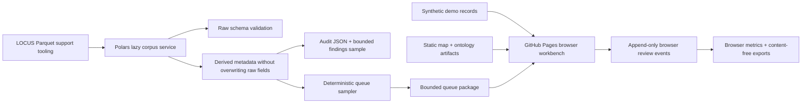

# Local Law Analytics Platform: Polars-First Evaluator Blueprint

This document supersedes the earlier DuckDB-first analytics blueprint for the current milestone.

Primary stack for the evaluator MVP:

- GitHub Pages static HTML/CSS/JavaScript for the primary and only supported user-facing workbench.
- Browser localStorage for reviewer-local append-only events.
- Browser File API for bounded queue import and user-triggered exports.
- Static JSON artifacts for map layers, ontology, models, status, deterministic inquiry, progressive inquiry briefings, and charts.
- Polars lazy frames over local Parquet.
- SQLite through Python `sqlite3` for support tooling and local queue package preparation.

Optional later:

- DuckDB for ad hoc SQL after evaluator MVP.
- LanceDB for semantic retrieval after relevance evaluation exists.
- Postgres for multi-user review workflows.
- Census/FIPS/geospatial enrichment after reviewed crosswalks exist.

## Source

- Dataset: https://huggingface.co/datasets/LocalLaws/LOCUS-v1
- Paper: https://arxiv.org/abs/2606.19334
- License: CC-BY-NC-4.0
- Reported release scale: 2,211,516 rows, eight Parquet shards, about 1.77 GB

Published raw columns:

```text
header
content
is_substantive
function
topic
source_jurisdiction_type
state
city
county
enforcement_discretion
opacity
paternalism
problem_salience
```

## Current Data Flow



## Execution Commands

Primary workbench:

```text
https://evcatalyst.github.io/evolocus/
```

Publish synthetic static analysis artifacts:

```bash
PYTHONPATH=src python -m evolocus.cli publish-analysis \
  --output site/data/analysis \
  --dataset-revision synthetic-demo \
  --include-record-samples
```

Publish real aggregate artifacts into ignored preview storage before copying to Pages:

```bash
PYTHONPATH=src python -m evolocus.cli publish-analysis \
  --input 'data/raw/locus-v1/<revision>/**/*.parquet' \
  --dataset-revision '<revision>' \
  --output data/exports/analysis-preview \
  --max-units 1000
```

Audit:

```bash
PYTHONPATH=src python -m evolocus.cli audit-locus \
  --input 'data/raw/locus-v1/<revision>/**/*.parquet' \
  --dataset-revision '<revision>' \
  --output data/processed/locus-v1/<revision>/audit
```

Evaluation store:

```bash
PYTHONPATH=src python -m evolocus.cli init-evaluation \
  --db data/evaluation/evolocus_eval.sqlite3
```

Seed queue:

```bash
PYTHONPATH=src python -m evolocus.cli seed-evaluation \
  --input 'data/raw/locus-v1/<revision>/**/*.parquet' \
  --db data/evaluation/evolocus_eval.sqlite3 \
  --queue baseline-v1 \
  --strategy balanced_labels \
  --size 500 \
  --seed 20260621 \
  --dataset-revision '<revision>'
```

Default content-free export:

```bash
PYTHONPATH=src python -m evolocus.cli export-evaluation \
  --db data/evaluation/evolocus_eval.sqlite3 \
  --queue baseline-v1 \
  --output data/exports/baseline-v1 \
  --without-content
```

## Design Guarantees

- Raw fields are preserved unchanged.
- Derived values live in separate columns.
- Generic jurisdiction/name fields are not required.
- `source_jurisdiction_type`, `city`, and `county` derive jurisdiction identity.
- No FIPS/county assignment is fabricated.
- Null topic values are evaluated in context of `is_substantive`.
- Unexpected labels are reported as audit findings.
- Score direction is unverified and displayed only as neutral relative model scores.
- No regulatory-burden score is computed during this milestone.
- SQLite stores bounded queue snapshots and review history, not the full corpus.
- GitHub Pages hosts the evaluator workbench and may publish reviewed aggregate-only LOCUS artifacts.
- GitHub Pages must never publish real LOCUS rows, ordinance text, local SQLite state, local exports, or secrets.
- Browser imports must be bounded review queues, not full LOCUS shards.
- Model outputs are imported as released LOCUS columns; downloading derivative model weights is deferred until model cards are verified.

## Deferred Analytics

The following are future work only:

- semantic search;
- RAG;
- embeddings;
- Census and FIPS enrichment;
- geospatial maps;
- FastAPI;
- Postgres;
- Superset;
- scrapers;
- model fine-tuning.

Each deferred module should include its own human-evaluation or provenance checks before publication.
